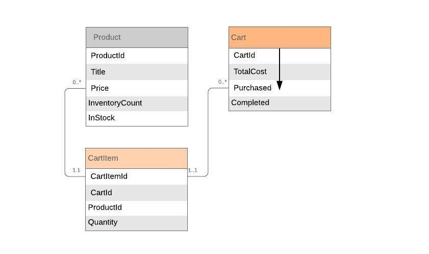

# Winternify
Shopify Summer 2019 Developer Intern [Challenge](https://bit.ly/2Mk5wvf)

## ER Diagram

## Framework
* Rails 5.2.2
* Ruby 2.6.0

## REST API

API Documentation [documentation](https://documenter.getpostman.com/view/2741447/RzteTYFp)

## Steps

1. API can be tested with Postman by replicating the calls in the above API Documentation

2. User needs to authenticate with a token before making any API calls:
    1. Open Postman
    2. Create a POST request with the following details:
        URL: http://0.0.0.0:3000/authenticate
        Headers: `Content-Type: application/json`
        Body: `{"email": "pratiman@winternify.com", "password": "summer2019"}`
